# 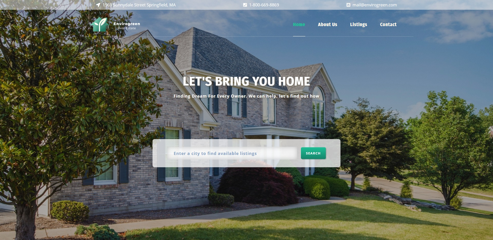

# EnviroGreen Reality

This A very simple, fictional Real Estate site, complete with searching capabilities, and a small admin cms, which has full CRUD capabilities. The front-end is simply HTML/CSS using the BootStrap framework. And a small bit of JavaScript, mainly to handle the AJAX search, on the homepage. The back-end however was built using the Laravel 5 PHP framework, and uses a MySQL database. The Admin CMS allows users to create, update, and delete rental listings, as well as 
the same for staff.

This has since been updated with some slight design changes, mostly to the home page.

<!-- Tables -->
|      |         |
| -------- | -------------- |
| 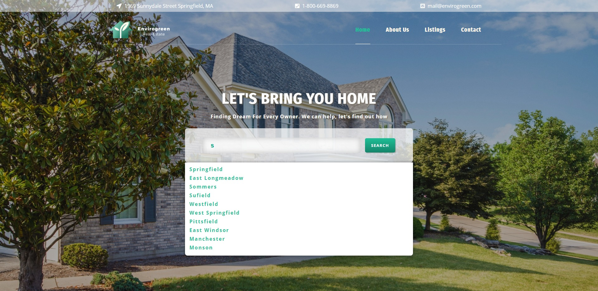| 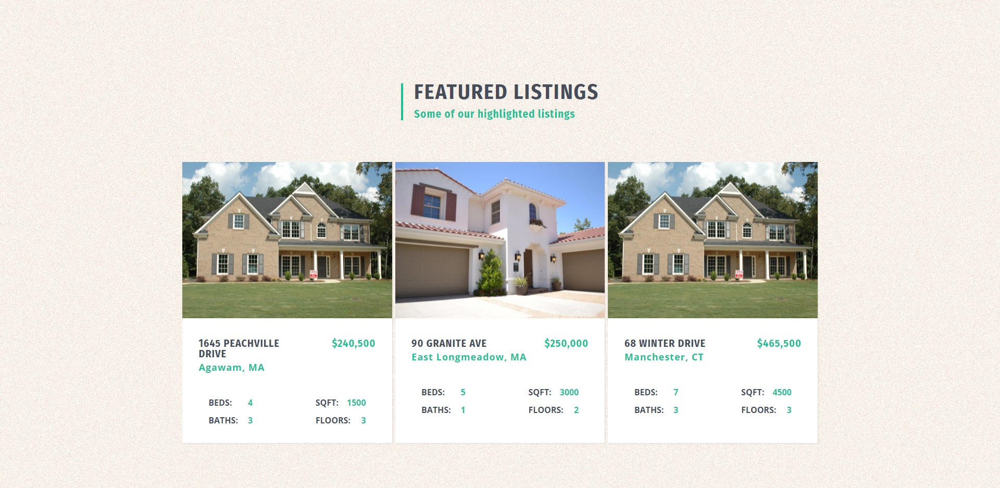|
| 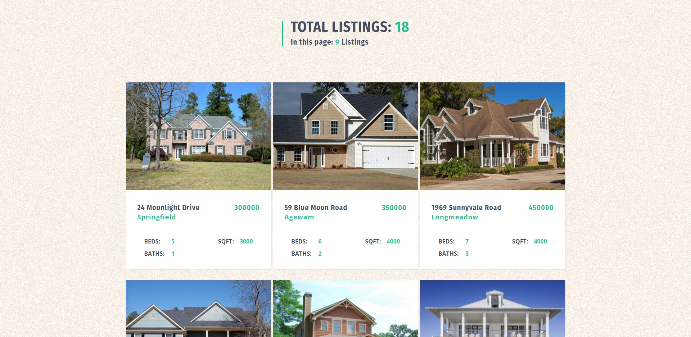| 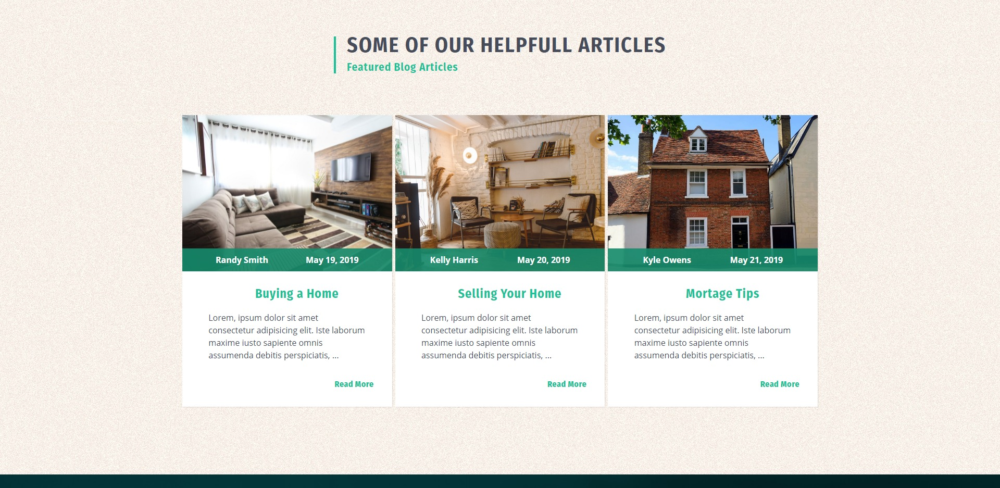|
| 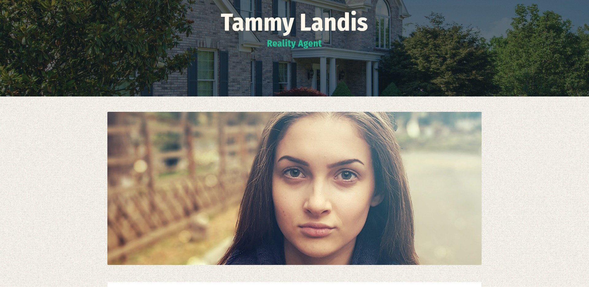| 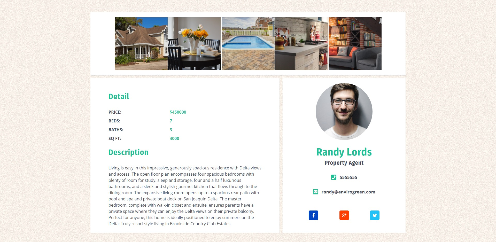|
| 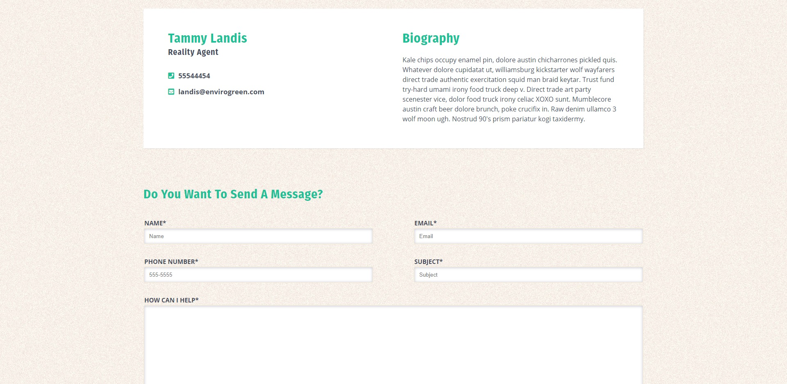| 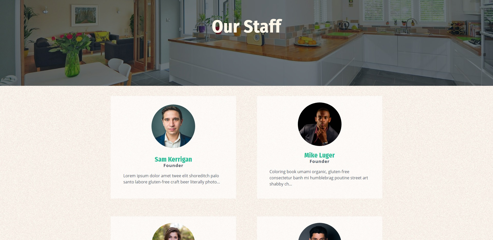|
| 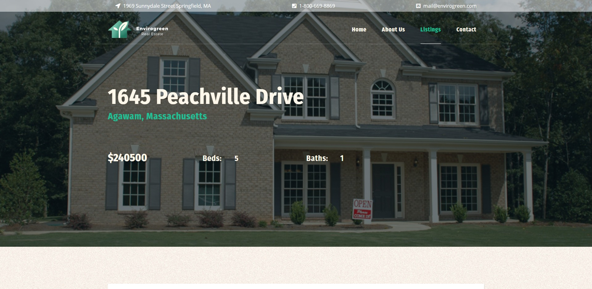| 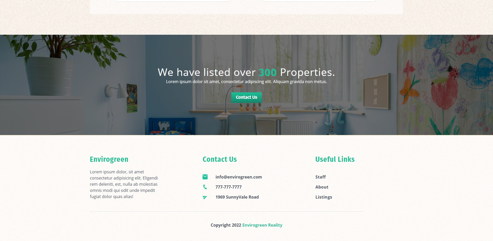|

## Getting Started

To check this out for yourself. Download the files, create a database, or use the enviro-2.sql file to create a database, that's already prepopulated with data.
### Prerequisites

A localhost Xamp, Wamp etc. And Php installed on your machine.

## Built With

* [PHP]
* [Laravel 5.2]
* [JavaScript]
* [JQuery](https://jquery.com/)
* Stock photos from (https://www.pexels.com/)
